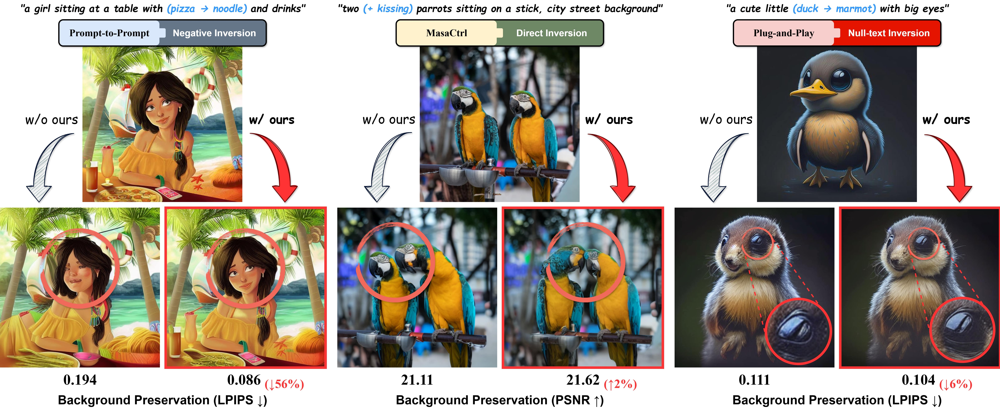

<div align="center">

# A Plug-and-Play Approach for Robust Image Editing in Text-to-Image Diffusion Models



[Hyunwook Jo](https://github.com/ugiugi0823/), &nbsp; [Jiseung Maeng](https://github.com/js43o/), &nbsp; [Junhyung Park](https://github.com/kevin20012), &nbsp; [Namhyuk Ahn](https://gcl-inha.github.io/), &nbsp; [In Kyu Park](https://sites.google.com/view/vcl-lab/)\* &nbsp; </br>
Department of Electrical and Computer Engineering, Inha University</br>
\*Corresponding Author


</div>

## 🌱 Environment Setting

**For Prompt-to-Prompt**

```bash
conda env create --file env/p2p.yaml
```

**For MasaCtrl**

```bash
conda env create --file env/masactrl.yaml
```

**For PnP**

```bash
conda env create --file env/pnp.yaml
```

**(+) For null-text inversion with SDXL**

```bash
conda env create --file env/nullsdxl.yaml
```

## 🚀 Run

### 🔥 Run Bench described in paper

```bash
bash run_with_bench.sh
```

### 📝 How to write prompt

In **main.py**

```python
original_prompt = "A white horse running in the field"
editing_prompt = "Water color of a white horse running in the field"
image_path = "./img/horse.png"
editing_instruction = "" #You can write the instruction on it
blended_word = [] #Ex. ["horse", "dog"] if you want to change word "horse" in source prompt to word "dog" in target prompt
```

### 🎯 How to run to get result

You can obtain images by combining below:

| 🔒 Preserving source Image | 🎨 Editing image by target prompt | 🚀 Using Our method |
| :------------------------- | :-------------------------------- | :------------------ |
| null-text-inversion        | p2p                               | ALPHA               |
| negative-prompt-inversion  | masactrl                          |
| directinversion            | pnp                               |
| ddim                       |                                   |

(You can observe the results obtained without the image preservation technique by using "ddim".)

Since the Conda environment depends on the specific editing method, you must use appropriate environment for each editing method.

please make sure to execute commands using:
refer to **run.sh**

```bash
conda run -n p2p --no-capture-output python -u main.py --data_path img \
                --output_path output \
                --edit_method_list directinversion+p2p
```

simply using bash for all method

```bash
bash run_one_img.sh
```

And Finally, You can find the result in **output** directory.

- (+) If you want to use **null-text inversion** with the **SDXL** model, please refer to the `/null-sdxl` folder. It contains the source code, and you can modify the prompts, input image, ALPHA value, etc., and run the code.

  ```
  bash run.sh
  ```

## Acknowledgement
This work was supported by the Institute of Information \& communications Technology Planning \& Evaluation~(IITP) grant funded by the Korean government~(MSIT) (No.RS-2022-00155915, Artificial Intelligence Convergence Innovation Human Resources Development (Inha University) and  No.RS-2021-II212068, Artificial Intelligence Innovation Hub and IITP-2024-RS-2024-00360227, Leading Generative AI Human Resources Development).


## References
This code has been modified based on the [PnP_Inversion](https://github.com/cure-lab/PnPInversion/tree/main).
Following the implementation from [null-text inversion](https://github.com/google/prompt-to-prompt/#null-text-inversion-for-editing-real-images), [negative-prompt inversion](https://arxiv.org/abs/2305.16807), [Direct inversion](https://arxiv.org/abs/2310.01506), [prompt-to-prompt](https://github.com/google/prompt-to-prompt), [MasaCtrl](https://github.com/TencentARC/MasaCtrl), [pix2pix-zero](https://github.com/pix2pixzero/pix2pix-zero) , [Plug-and-Play](https://github.com/MichalGeyer/plug-and-play).
Sincerely thank all contributors.